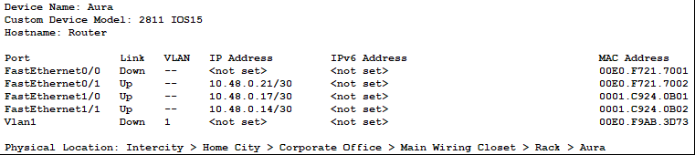
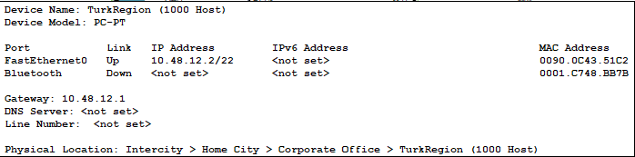
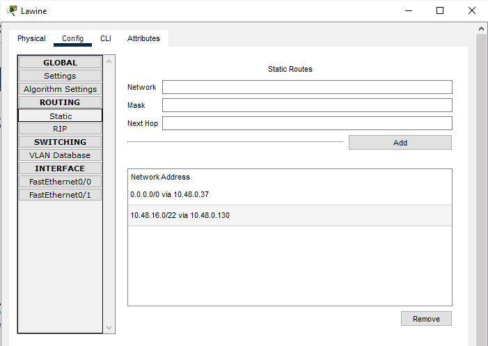

# Jarkom-Modul-4-E23-2023

1. Soal shift dikerjakan pada Cisco Packet Tracer dan GNS3 menggunakan metode perhitungan CLASSLESS yang berbeda.
Keterangan: Bila di CPT menggunakan VLSM, maka di GNS3 menggunakan CIDR atau sebaliknya
2. Jika tidak ada pemberitahuan revisi soal dari asisten, berarti semua soal BERSIFAT BENAR dan DAPAT DIKERJAKAN.
3. Untuk di GNS3 CLOUD merupakan NAT1 jangan sampai salah agar bisa terkoneksi internet.
4. Pembagian IP menggunakan Prefix IP yang telah ditentukan pada modul pengenalan
5. Pembagian IP dan routing harus SE-EFISIEN MUNGKIN.


---
### Penyelesaian
---
Untuk menyelesaikan praktikum modul ini saya memilih mengerjakannya dengan membaginya menjadi:
- VLSM : Menggunakan Cisco Packet Tracer (CPT)
- CIDR : Menggunakan GNS3

Sebelumnya dilakukan terlebih dahulu pembagian subnet (rute) sebagai berikut:


Dari pembagian subnet ini nantinya akan ditemukan pembagian ip yang sesuai menggunakan metode classless VLSM dan CIDR Tree. Perhitungan ip sudah termasuk ip router. Pembagian ip digunakan untuk melakukan subnetting pada topologi, setelah subnetting berhasil langkah terakhir adalah melakukan routing.

---
### VLSM (CPT)
---

Berikut ini adalah VLSM tree yang telah dibuat :


- Karena pada pembagian subnet tercatat total ip adalah 4255 dan netmask yang cukup untuk menampungnya adalah /19 yang mana mampu menampung ip sebanyak 8190.
- Root dari tree adalah netmask /19 dengan ip yang dimulai dari 10.48.0.0.
- Pada pembuatan tree ini saya menggunakan penambahan dari ip terkecil, Kaki kiri dari tree akan selalu menunjukkan awal mula dari ip yang tersedia, sedangkan kaki kanan adalah ip setelah ip kaki kiri, pada kaki kiri juga saya berikan batas atas atau broadcast address dari ip dengan netmask tersebut untuk mempermudah penentuan ip di kaki kanan tree
- Iterasi dilakukan terus menerus dari netmask /19 hingga /30.

Sehingga diperoleh pembagian ip VLSM:


Untuk isi config pembagian ip diset seperti ini:
- Router memliki IP NID + 1
- Host / Client memiliki IP Rourter + 1 atau IP Client sesubnet + 1
- Host / Client memiliki gateway sesuai IP router dalam subnet mereka
- 1 router bisa memiliki beberapa IP karena dalam 1 router dapat menangani beberapa ethernet interface / subnet

Karena config semuanya kurang lebih mirip, jadi dibawah ini diberi contoh assign IP Router dan Client dalam 1 Subnet saja:

- Himmel :


- SchwerMountains :


- Jika config sudah sesuai maka dalam 1 Subnet ini semuanya pasti bisa saling melakukan ping
- Konfigurasi IP ini dilakukan ke SETIAP subnet nya sebagaimana pembagian IP di sheet perhitungan.

Berikut merupakan config selengkapnya dari setiap node :

- RohrRoad


- Flamme


- SchwerMountains


- Himmel


- Frieren


- LakeKoridor


- Aura



- Denken


- RoyalCapital


- WilleRegion


- Eisen


- Richter


- Revolte


- Stark


- Lugner


- TurkRegion



- GlobeForest


- Linie


- GranzChannel


- Lawine


- BredtRegion


- Sein


- Heiter


- RiegelCanyon


- LaubHills


- AppetitRegion


- LakeKorridor


**ROUTING**

Untuk routing dilakukan dengan cara beberapa tahap:
- Routing dilakukan dengan cara static dimana next hop dari routing adalah adjacent router terdekat dengan subnet yang ingin dituju, semisal aura ingin berkenalan dengan subnet a10 maka NID dan netmask diisi milik a10 dan next-hop nya adalah IP Denken yang mengarah ke aura.
- Pada static routing juga dibutuhkan default routing agar router dapat mengirimkan paket sesuai dengan tujuan.
- Kemudian untuk setiap router yang terhubung dengan router lain (nexthop untuk berkenalan lebih dari 1 hop) yang memiliki host/client perlu mengenali subnet mereka juga
- Contoh:
    - Flamme harus berkenalan dengan subnet a1, a3, a4, a5
    - Frieren harus berkenalan dengan subnet a1, a2, a3, a4, a5
    - Lawine harus berkenalan dengan subnet a18 dan a19
    - dst.

- Binding everywhere dari setiap router cukup 1 saja yang mengarah ke router aura / terdekat dengan aura, hal ini dilakukan untuk efisiensi routing (100% success)
- Jika aura sudah disetup sebagaimana pengaturan routing di atas maka otomatis semua subnet bisa saling mengenal via aura

Untuk melihat CONFIG SELENGKAPNYA sebagai berikut :

- Fern

  

- Flamme

  

- Himmel

  

- Frieren

  

- Aura

  

- Denken

  

- Eisen

  

- Lugner

  

- Linie

  

- Lawine

  

- Heiter

  


**HASIL PING**


## CIDR

Prefix IP

```
10.48
```

### Penggabungan IP

#### Rute


#### Penggabungan I 


#### Penggabungan II


#### Penggabungan III


  

#### Penggabungan IV


#### Penggabungan V


#### Penggabungan VI


 
